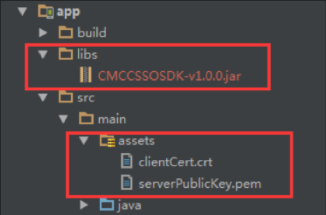
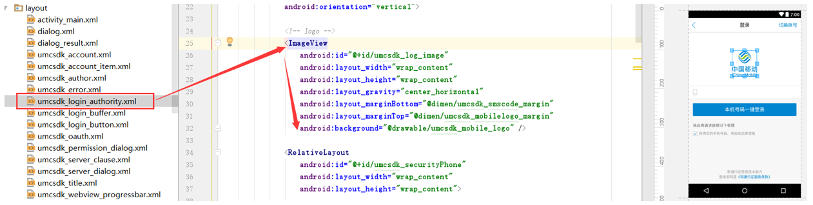
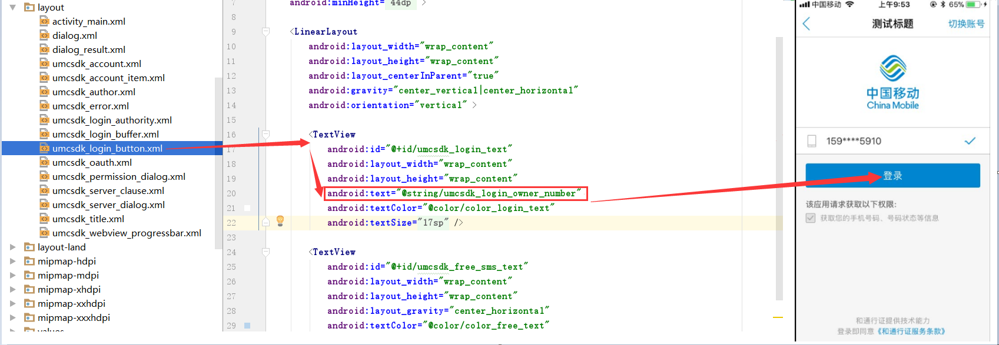
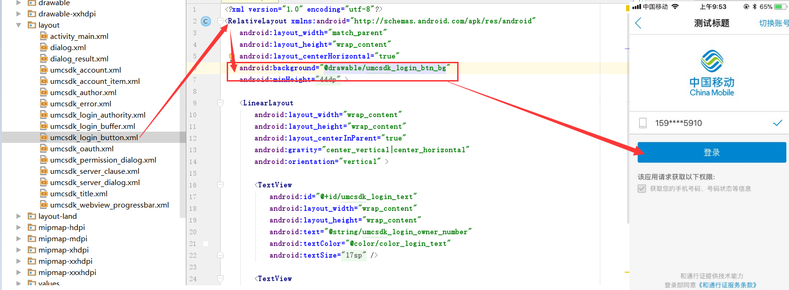

# 1. 开发环境配置
sdk技术问题沟通QQ群：609994083
## 1.1. 总体使用流程

1. 调用SDK方法来获得`token`，步骤如下：

    a.  构造SDK中认证工具类AuthnHelper的对象；</br>
    b.  使用AuthnHelper中的umcLoginByType方法，获得token。</br>

2. 使用平台获取用户信息接口，取得用户信息

    </br>

## 1.2. 新建工程并导入SDK的jar文件

1. 将`CMCCSSOSDK_*.jar`拷贝到应用工程的libs目录下，如没有该目录，可新建；
2. 将sdk所需要的证书文件`clientCert.crt`、`serverPublicKey.pem`拷贝到项目`assets`目录下。



3. 将sdk所需要的资源文件从res目录下的文件添加到项目工程中，如图：

`     anim`文件：


`   drawable`、`drawable-xxhdpi`文件：


</br>


`layout`文件：


`values`文件：


</br>

## 1.3. 配置AndroidManifest

注意：为避免出错，请直接从Demo中复制带<!-- required -->标签的代码

**1. 配置权限**

```java
<uses-permission android:name="android.permission.INTERNET" />
<uses-permission android:name="android.permission.READ_PHONE_STATE" />
<uses-permission android:name="android.permission.ACCESS_WIFI_STATE" />
<uses-permission android:name="android.permission.ACCESS_NETWORK_STATE" />
<uses-permission android:name="android.permission.SEND_SMS" />
<uses-permission android:name="android.permission.CHANGE_NETWORK_STATE" />
<uses-permission android:name="android.permission.WRITE_SETTINGS"/>
<uses-permission android:name="android.permission.WRITE_EXTERNAL_STORAGE" />
```

**2. 配置授权登录activity**

开发者根据需要配置横竖屏方向：`android:screenOrientation`
示列代码为`unspecified`（默认值由系统选择显示方向）

```java
<activity
    android:name="com.cmic.sso.sdk.activity.OAuthActivity"
    android:configChanges="orientation|keyboardHidden|screenSize"
    android:screenOrientation="unspecified"
    android:launchMode="singleTop">
</activity>
<!-- required -->
<activity
    android:name="com.cmic.sso.sdk.activity.BufferActivity"
    android:configChanges="orientation|keyboardHidden|screenSize"
    android:screenOrientation="unspecified"
    android:launchMode="singleTop">
</activity>
<!-- required -->
<activity
    android:name="com.cmic.sso.sdk.activity.LoginAuthActivity"
    android:configChanges="orientation|keyboardHidden|screenSize"
    android:screenOrientation="unspecified"
    android:launchMode="singleTop">
</activity>
```

通过以上两个步骤，工程就已经配置完成了。接下来就可以在代码里使用统一认证的SDK进行开发了

</br>

## 1.4. SDK使用步骤

**1. 创建一个AuthnHelper实例** 

`AuthnHelper`是SDK的功能入口，所有的接口调用都得通过AuthnHelper进行调用。因此，调用SDK，首先需要创建一个AuthnHelper实例，其代码如下：

```java
public void onCreate(Bundle savedInstanceState) {
    super.onCreate(savedInstanceState);
    mContext = this;    
    ……
    mAuthnHelper = AuthnHelper.getInstance(mContext);
    }
```

**2. 实现回调**

所有的SDK接口调用，都会传入一个回调，用以接收SDK返回的调用结果。结果以`JsonObjent`的形式传递，`TokenListener`的实现示例代码如下：

```java
mListener = new TokenListener() {
    @Override
    public void onGetTokenComplete(JSONObject jObj) {
        if (jObj != null) {
            mResultString = jObj.toString();
            mHandler.sendEmptyMessage(RESULT);
            if (jObj.has("token")) {
                mtoken = jObj.optString("token");
            }
        }
    }
};
```

**3. 接口调用**

```java
mAuthnHelper.umcLoginByType(Constant.APP_ID, 
        Constant.APP_KEY, 
        AuthnHelper.UMC_LOGIN_IMPLICIT,
        AuthnHelper.AUTH_TYPE_DYNAMIC_SMS + AuthnHelper.AUTH_TYPE_WAP, 
        mListener);
```


<div STYLE="page-break-after: always;"></div>

# 2. SDK方法说明

## 2.1. 获取管理类的实例对象

### 2.1.1. 方法描述

获取管理类的实例对象

</br>

**原型**

```java
public AuthnHelper (Context context)
```

</br>

### 2.1.2. 参数说明

| 参数      | 类型      | 说明                              |
| ------- | ------- | ------------------------------- |
| context | Context | 调用者的上下文环境，其中activity中this即可以代表。 |

</br>

## 2.2. 登录方法

开发者向统一认证服务器获取用户身份标识`openId`和临时凭证`token`。</br>

**openId：**每个APP每个手机号码对应唯一的openId。</br>

**临时凭证token：**开发者服务端可凭临时凭证token通过3.1获取用户信息接口获取用户手机号码。

</br>

### 2.2.1. 显式登录

#### 2.2.1.1. 方法描述

**业务流程图**


SDK自动调起登录等待界面（图一），同时自动获取本机号码；若获取本机号码成功，自动切换到授权登录页面（图二），用户授权登录后，即可使用本机号码进行登录；若用户获取本机号码失败，自动跳转到短信验证码登录页面（图三），引导用户使用短信验证码登录。


用户授权登录后，给开发者返回`token`和`用户ID(openID)`等信息。 

</br>

**原型**

```java
public void umcLoginByType(final String appId, 
            final String appKey,
            final int loginType, 
            final String authType, 
            final TokenListener listener)
```

</br>

#### 2.2.1.2. 参数说明

**请求参数**

| 参数        | 类型            | 说明                                       |
| :-------- | :------------ | :--------------------------------------- |
| appId     | String        | 应用的AppID                                 |
| appkey    | String        | 应用密钥                                     |
| loginType | String        | 登录类型，AuthnHelper.UMC_LOGIN_DISPLAY       |
| authType  | String        | 认证类型,目前支持三种认证类型:<br />1.短信验证码：AuthnHelper.AUTH_TYPE_DYNAMIC_SMS（短信验证码关闭时，用户授权页右上角“切换账号”按钮将隐藏<br />2.网关鉴权：AuthnHelper.AUTH_TYPE_WAP<br />3.短信上行：AuthnHelper.AUTH_TYPE_SMS<br />（开发者可单独选择其中一种认证类型，也可以用“+”号组合同时使用三种认证类型，SDK登录认证优先级顺序为：网关鉴权 → 短信上行 → 短信验证码） <br />示例：AuthnHelper.AUTH_TYPE_WAP + AuthnHelper.AUTH_TYPE_DYNAMIC_SMS |
| listener  | TokenListener | TokenListener为回调监听器，是一个java接口，需要调用者自己实现；TokenListener是接口中的认证登录token回调接口，OnGetTokenComplete是该接口中唯一的抽象方法，即void OnGetTokenComplete(JSONObject  jsonobj) |

</br>

**响应参数**

OnGetTokenComplete的参数JSONObject，含义如下：

| 字段         | 类型     | 含义                                       |
| ---------- | ------ | ---------------------------------------- |
| resultCode | Int    | 接口返回码，“103000”为成功。具体响应码见4.1 SDK返回码       |
| resultDesc | String | 失败时返回：返回错误码说明                            |
| token      | String | 成功时返回：身份标识，字符串形式的token，应用将该token经应用侧平台向统一认证平台请求认证 |
| openId     | String | 成功时返回：用户身份唯一标识                           |

</br>

#### 2.2.1.3. 示例

**请求示例代码**

```java
mAuthnHelper.umcLoginByType(Constant.APP_ID, 
        Constant.APP_KEY,
        AuthnHelper.UMC_LOGIN_DISPLAY, 
        AuthnHelper.AUTH_TYPE_DYNAMIC_SMS + AuthnHelper.AUTH_TYPE_WAP, 
        mListener);
```

**响应示例代码**

```
{
    "authType": "网关鉴权",
    "resultCode": "103000",
    "openId": "9M7RaoZH1DUrJ15ZjJkctppraYpoNKQW9xKtQrcmCGTFONUKeT3w",
    "token": "848401000133020037515451304E7A497A4D7A5A4651554A474E6A41784D304E4640687474703A2F2F3231312E3133362E31302E3133313A383038302F403031030004051C7840040012383030313230313730373230313030303137050010694969C667EA4D248DFA125D7C4BD35BFF00207EF179935851E1578B313B366007126A3FD3667BCD2B812EC2D084B8924E7164"
}
```

</br>

### 2.2.2. 预取号

#### 2.2.2.1. 方法描述

使用显式登录前，可以通过预取号提前获取用户信息并缓存。用户再次登录时，会自动使用缓存的信息快速登录来获取`token`和`用户ID(openID)`等信息。提高登录速度，缓存的有效时间是5min并且只有一次使用有效期。

</br>

**原型**

```java
public void umcLoginPre(final String appId, 
            final String appKey,
            final TokenListener listener)
```

</br>

#### 2.2.2.2. 参数说明

**请求参数**

| 参数       | 类型            | 说明                                       |
| :------- | :------------ | :--------------------------------------- |
| appId    | String        | 应用的AppID                                 |
| appkey   | String        | 应用密钥                                     |
| listener | TokenListener | TokenListener为回调监听器，是一个java接口，需要调用者自己实现；TokenListener是接口中的认证登录token回调接口，OnGetTokenComplete是该接口中唯一的抽象方法，即void OnGetTokenComplete(JSONObject  jsonobj) |

</br>

**响应参数**

OnGetTokenComplete的参数JSONObject，含义如下：

| 字段         | 类型      | 含义                                 |
| ---------- | ------- | ---------------------------------- |
| resultCode | Int     | 接口返回码，“103000”为成功。具体响应码见4.1 SDK返回码 |
| desc       | boolean | 成功标识，true为成功。                      |

</br>

#### 2.2.2.3. 示例

**请求示例代码**

```java
mAuthnHelper.umcLoginPre(Constant.APP_ID, 
        Constant.APP_KEY,
        mListener);
```

**响应示例代码**

```
{
    "resultCode": "103000",
    "desc": "true",
}
```

## 2.3. 授权页界面配置说明

SDK登录授权页支持部分元素开发者自定义</br>

###2.3.1. 标题

SDK自动读取APP名称，如航班管家，标题栏显示的文字内容为“登录航班管家”

###2.3.2. 自定义logo 

开发者自定义logo时，需考虑终端适配问题



### 2.3.3. 登录按钮文案



### 2.3.4. 登录按钮颜色




<div STYLE="page-break-after: always;"></div>


# 3. 平台接口说明

## 3.1. 获取用户信息接口

### 3.1.1. 接口说明

**功能**

业务平台或服务端携带用户授权成功后的token来调用统一认证服务端获取用户信息。

**请求地址：** https://www.cmpassport.com/unisdk/rsapi/tokenValidate

**协议：** HTTPS 

**请求方法：** POST+json

**回调地址：**请参考开发者接入流程文档中`配置业务服务端地址`相关操作

</br>

### 3.1.2. 参数说明

**请求参数**

| 参数            |  层级  |   类型   |  约束  | 说明                                       |
| :------------ | :--: | :----: | :--: | :--------------------------------------- |
| header        |  1   |        |  必选  |                                          |
| version       |  2   | string |  必选  | 填1.0                                     |
| msgid         |  2   | string |  必选  | 标识请求的随机数即可(1-36位)                        |
| systemtime    |  2   | string |  必选  | 请求消息发送的系统时间，精确到毫秒，共17位，格式：20121227180001165 |
| strictcheck   |  2   | string |  必选  | 验证源ip合法性，填写”1”，统一认证会校验sourceid与出口ip对应关系（ip 地址的配置方法请参考接入流程文档中`配置业务服务端地址`相关操作) |
| sourceid      |  2   | string |  可选  | 业务集成统一认证的标识，应用接入后可获取                     |
| ssotosourceid |  2   | string |  可选  | 单点登录时使用，填写被登录业务的sourceid                 |
| appid         |  2   | string |  可选  | 业务在统一认证申请的应用id                           |
| apptype       |  2   | string |  可选  | 1:BOSS<br />2:web<br />3:wap<br />4:pc客户端<br />5:手机客户端 |
| expandparams  |  2   | string | 扩展参数 | map(key,value)                           |
| body          |  1   |        |  可选  |                                          |
| token         |  2   | string |  可选  | 需要解析的凭证值。                                |

</br>

**响应参数**

| 参数                  | 层级   | 类型     | 约束   | 说明                                       |
| ------------------- | ---- | ------ | ---- | ---------------------------------------- |
| header              | 1    |        | 必选   |                                          |
| version             | 2    | string | 必选   | 1.0                                      |
| inresponseto        | 2    | string | 必选   | 对应的请求消息中的msgid                           |
| systemtime          | 2    | string | 必选   | 响应消息发送的系统时间，精确到毫秒，共17位，格式：20121227180001165 |
| resultcode          | 2    | string | 必选   | 返回码                                      |
| body                | 1    |        | 必选   |                                          |
| pcid                | 2    | string | 必选   | 伪码id                                     |
| usessionid          | 2    | string | 可选   | 暂忽略                                      |
| openid              | 2    | string | 可选   | 用户统一账号的系统标识                              |
| andid               | 2    | string | 可选   | 用户的“和ID”                                 |
| msisdn              | 2    | string | 可选   | 表示手机号码                                   |
| email               | 2    | string | 可选   | 表示邮箱地址                                   |
| loginidtype         | 2    | string | 可选   | 登录使用的用户标识：<br />0:手机号码<br />1：邮箱         |
| msisdntype          | 2    | string | 可选   | 手机号码的归属运营商<br />0:中国移动<br />1:中国电信<br />2:中国联通<br />99:未知的异网手机号码 |
| province            | 2    | string | 可选   | 用户所属省份(暂无)                               |
| authtype            | 2    | string | 可选   | 认证方式，取值参见附录1 认证方法标识                      |
| authtime            | 2    | string | 可选   | 统一认证平台认证用户的时间                            |
| lastactivetime      | 2    | string | 可选   | 暂无                                       |
| relateToAndPassport | 2    | string | 可选   | 是否已经关联到统一账号，暂无用处                         |
| fromsourceid        | 2    | string | 可选   | 来源sourceid（即签发token sourceid）            |
| tosourceid          | 2    | string | 可选   | 目的sourceid（即被登录业务sourceid）               |

</br>

### 3.1.3. 示例

**请求示例**

```
{
        "header": {
            "strictcheck":"0",
            "version": "1.0",
            "msgid": "40a940a940a940a93b8d3b8d3b8d3b8d",
            "systemtime": "20170515090923489",
            "appid": "10000001",
            "apptype": "5"
        },
        "body": {
            "token": "8484010001320200344E6A5A4551554D784F444E474E446C434E446779517A673340687474703A2F2F3139322E3136382E31322E3233363A393039302F0300040353EA68040006313030303030FF00203A020A143C6703D7D0530953C760744C7D61F5F7B546F12BC17D65254878748C"
        }
}
```

**响应示例**

```
{
         "header": {
            "inresponseto": "40a940a940a940a93b8d3b8d3b8d3b8d",
            "resultcode": "103000",
            "systemtime": "20170522204845598",
            "version": "1.0"
        },
        "body": {
            "msisdntype": "0",
            "usessionid": "NjZEQUMxODNGNDlCNDgyQzg3@http://192.168.12.236:9090/",
            "openid": "000000000",
            "loginidtype": "0",
            "authtime": "2017-05-22 20:48:45",
            "msisdn": "13683329795",
            "lastactivetime": "",
            "authtype": "WAPGW",
            "relateToAndPassport": "1"
        }
}
```

<div STYLE="page-break-after: always;"></div>

# 4. 返回码说明

##4.1. SDK返回码

使用SDK时，SDK会在认证结束后将结果回调给开发者，其中结果为JSONObject对象，其中resultCode为结果响应码，103000代表成功，其他为失败。成功时在根据token字段取出身份标识。失败时根据resultCode定位失败原因。

| 编码     | 返回码描述                  |
| ------ | ---------------------- |
| 103000 | 成功                     |
| 102101 | 无网络                    |
| 102102 | 网络异常                   |
| 102223 | 数据解析异常                 |
| 102121 | 用户取消认证                 |
| 102505 | 业务未注册                  |
| 102506 | 请求出错                   |
| 102507 | 请求超时                   |
| 102201 | 自动登陆失败                 |
| 102202 | 应用签名失败                 |
| 102203 | 输入参数错误                 |
| 102204 | 正在gettoken处理           |
| 102210 | 指定号码非本机号码              |
| 102211 | 短信验证码验证成功后返回随机码为空      |
| 102222 | http响应头中没有结果码          |
| 102299 | other failed           |
| 102302 | 调用service超时            |
| 103117 | mac异常 macError         |
| 103200 | ks无需更新                 |
| 103203 | 缓存用户不存在                |
| 200001 | imsi为空，跳到短信验证码登录       |
| 200002 | imsi为空，没有短信验证码登录功能     |
| 200003 | 复用中间件首次登录              |
| 200004 | 复用中间件二次登录              |
| 200005 | 用户未授权READ_PHONE_STATE                  |
| 200006 | 用户未授权SEND_SMS                  |
| 200007 | 不支持的认证方式 跳到短信验证码登录     |
| 200008 | 不支持的认证方式 没有短信验证码登录功能   |
| 200009 | 应用合法性校验失败              |
| 200010 | imsi获取失败或者没有sim卡，预取号失败 |

</br>

##4.2. 平台返回码

| 编码     | 返回码描述                |
| ------ | -------------------- |
| 103000 | 成功                   |
| 103101 | 签名错误                 |
| 103103 | 用户不存在                |
| 103104 | 用户不支持该种登录方式          |
| 103105 | 密码错误                 |
| 103106 | 用户名错误                |
| 103107 | 已存在相同的随机数            |
| 103108 | 短信验证码错误              |
| 103109 | 短信验证码超时              |
| 103111 | WAP网关IP不合法           |
| 103112 | 请求错误 reqError        |
| 103113 | Token内容错误            |
| 103114 | token验证 KS过期         |
| 103115 | token验证 KS不存在        |
| 103116 | token验证 sqn错误        |
| 103117 | mac异常 macError       |
| 103118 | sourceid不存在          |
| 103119 | appid不存在appidNOExist |
| 103120 | clientauth不存在        |
| 103121 | openid不存在            |
| 103122 | btid不存在              |
| 103123 | redisinfo不存在         |
| 103124 | ksnaf校验不一致           |
| 103125 | 手机格式错误               |
| 103126 | 手机号不存在               |
| 103127 | 证书验证，版本过期            |
| 103128 | gba webservice接口调用失败 |
| 103129 | 获取短信验证码的msgtype异常    |
| 103130 | 新密码不能与当前密码相同         |
| 103131 | 密码过于简单               |
| 103132 | 用户注册失败               |
| 103133 | sourceid不合法          |
| 103134 | wap方式手机号为空           |
| 103135 | 昵称非法                 |
| 103136 | 邮箱非法                 |
| 103138 | appid已存在             |
| 103139 | sourceid已存在          |
| 103200 | 不需要更新ks              |
| 103204 | 缓存随机数不存在             |
| 103205 | 服务器内部异常              |
| 103207 | 发送短信失败               |
| 103212 | 校验密码失败               |
| 103213 | 旧密码错误                |
| 103214 | 访问缓存或数据库错误           |
| 103226 | sqn过小或过大             |
| 103265 | 用户已存在                |
| 103901 | 短信验证码下发次数已达上限        |
| 103902 | 凭证校验失败               |
| 104001 | APPID和APPKEY已存在      |
| 105001 | 联通网关取号失败             |
| 105002 | 移动网关取号失败             |
| 105003 | 电信网关取号失败             |
| 105004 | 短信上行ip检测不合法          |
| 105005 | 短信上行发送信息为空           |
| 105006 | 手机号码为空               |
| 105007 | 手机号码格式错误             |
| 105008 | 短信内容为空               |
| 105009 | 解析失败                 |

