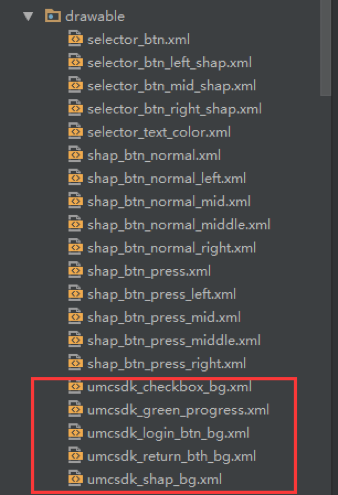
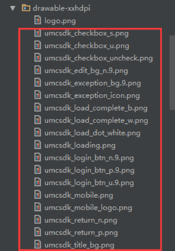
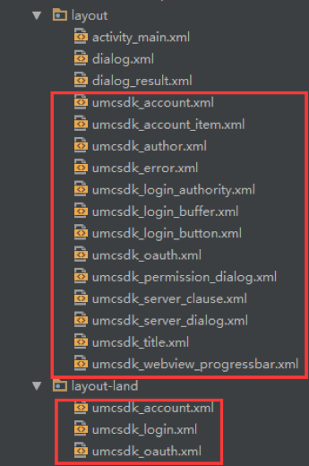
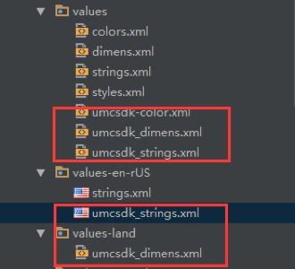
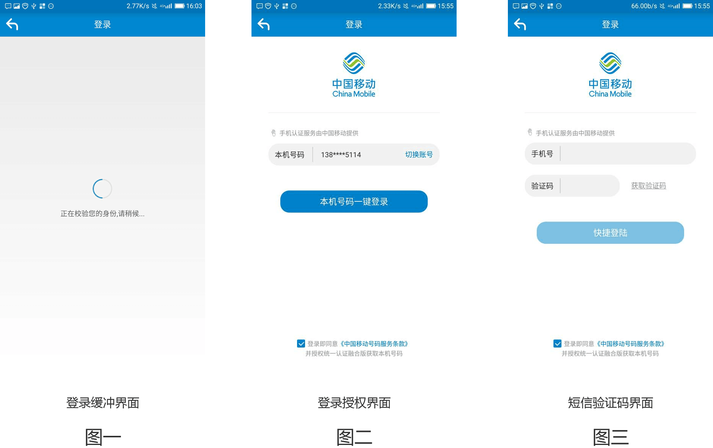

# 1. 开发环境配置
sdk技术问题沟通QQ群：609994083</br>

**注：SDK在获取token过程中，用户手机必须在打开数据网络情况下才能获取成功，纯wifi环境下会自动跳转到SDK的短信验证码页面（如果有配置）或者返回错误码**

## 1.1. 总体使用流程

1. 调用SDK方法来获得`token`，步骤如下：

    a.  构造SDK中认证工具类AuthnHelper的对象；</br>
    b.  使用AuthnHelper中的umcLoginByType方法，获得token。</br>

2. 使用平台获取用户信息接口，取得用户信息

    </br>

## 1.2. 新建工程并导入SDK的jar文件

1. 将`quick_login_android_**.jar`拷贝到应用工程的libs目录下，如没有该目录，可新建；
2. 将sdk所需要的证书文件`clientCert.crt`、`serverPublicKey.pem`拷贝到项目`assets`目录下。
3. 将sdk所需要的资源文件从res目录下的文件添加到项目工程中，如图：

`     anim`文件：


`   drawable`、`drawable-xxhdpi`文件：



</br>




`layout`文件：



`values`文件：



</br>

## 1.3. 配置AndroidManifest

注意：为避免出错，请直接从Demo中复制带<!-- required -->标签的代码

**1. 配置权限**

```java
<uses-permission android:name="android.permission.INTERNET" />
<uses-permission android:name="android.permission.READ_PHONE_STATE" />
<uses-permission android:name="android.permission.ACCESS_WIFI_STATE" />
<uses-permission android:name="android.permission.ACCESS_NETWORK_STATE" />
<uses-permission android:name="android.permission.SEND_SMS" />
<uses-permission android:name="android.permission.CHANGE_NETWORK_STATE" />
<uses-permission android:name="android.permission.WRITE_SETTINGS"/>
```

**2. 配置授权登录activity**

开发者根据需要配置横竖屏方向：`android:screenOrientation`
示列代码为`unspecified`（默认值由系统选择显示方向）

```java
<activity
    android:name="com.cmic.sso.sdk.activity.OAuthActivity"
    android:configChanges="orientation|keyboardHidden|screenSize"
    android:screenOrientation="unspecified"
    android:launchMode="singleTop">
</activity>
<!-- required -->
<activity
    android:name="com.cmic.sso.sdk.activity.BufferActivity"
    android:configChanges="orientation|keyboardHidden|screenSize"
    android:screenOrientation="unspecified"
    android:launchMode="singleTop">
</activity>
<!-- required -->
<activity
    android:name="com.cmic.sso.sdk.activity.LoginAuthActivity"
    android:configChanges="orientation|keyboardHidden|screenSize"
    android:screenOrientation="unspecified"
    android:launchMode="singleTop">
</activity>
```

通过以上两个步骤，工程就已经配置完成了。接下来就可以在代码里使用统一认证的SDK进行开发了

</br>

## 1.4. SDK使用步骤

**1. 创建一个AuthnHelper实例** 

`AuthnHelper`是SDK的功能入口，所有的接口调用都得通过AuthnHelper进行调用。因此，调用SDK，首先需要创建一个AuthnHelper实例，其代码如下：

```java
public void onCreate(Bundle savedInstanceState) {
    super.onCreate(savedInstanceState);
    mContext = this;    
    ……
    mAuthnHelper = AuthnHelper.getInstance(mContext);
    }
```

**2. 实现回调**

所有的SDK接口调用，都会传入一个回调，用以接收SDK返回的调用结果。结果以`JsonObjent`的形式传递，`TokenListener`的实现示例代码如下：

```java
mListener = new TokenListener() {
    @Override
    public void onGetTokenComplete(JSONObject jObj) {
        if (jObj != null) {
            mResultString = jObj.toString();
            mHandler.sendEmptyMessage(RESULT);
            if (jObj.has("token")) {
                mtoken = jObj.optString("token");
            }
        }
    }
};
```

**3. 接口调用**

```java
mAuthnHelper.getTokenExp(Constant.APP_ID, Constant.APP_KEY,
                 AuthnHelper.AUTH_TYPE_DYNAMIC_SMS+ AuthnHelper.AUTH_TYPE_WAP + AuthnHelper.AUTH_TYPE_SMS, mListener);
```


<div STYLE="page-break-after: always;"></div>

# 2. SDK方法说明

## 2.1. 获取管理类的实例对象

### 2.1.1. 方法描述

获取管理类的实例对象

</br>

**原型**

```java
public AuthnHelper (Context context)
```

</br>

### 2.1.2. 参数说明

| 参数      | 类型      | 说明                              |
| ------- | ------- | ------------------------------- |
| context | Context | 调用者的上下文环境，其中activity中this即可以代表。 |

</br>

## 2.2. 预取号

### 2.2.1. 方法描述

**功能**

使用SDK登录前，可以通过预取号方法提前获取用户信息并缓存。用户使用一键登录时，会优先使用缓存的信息快速请求SDK服务端获取`token`和`用户ID(openID)`等信息。提高登录速度，缓存的有效时间是5min并且只能使用一次。**注：预取号方法仅对显式登录有效。**

</br>

**原型**

```java
public void umcLoginPre(final String appId, 
            final String appKey,
            final TokenListener listener)
```

</br>

### 2.2.2. 参数说明

**请求参数**

| 参数       | 类型            | 说明                                       |
| :------- | :------------ | :--------------------------------------- |
| appId    | String        | 应用的AppID                                 |
| appkey   | String        | 应用密钥                                     |
| listener | TokenListener | TokenListener为回调监听器，是一个java接口，需要调用者自己实现；TokenListener是接口中的认证登录token回调接口，OnGetTokenComplete是该接口中唯一的抽象方法，即void OnGetTokenComplete(JSONObject  jsonobj) |

</br>

**响应参数**

OnGetTokenComplete的参数JSONObject，含义如下：

| 字段         | 类型      | 含义                                 |
| ---------- | ------- | ---------------------------------- |
| resultCode | Int     | 接口返回码，“103000”为成功。具体响应码见4.1 SDK返回码 |
| desc       | boolean | 成功标识，true为成功。                      |

</br>

### 2.2.3. 示例

**请求示例代码**

```java
mAuthnHelper.umcLoginPre(Constant.APP_ID, 
        Constant.APP_KEY,
        mListener);
```

**响应示例代码**

```
{
    "resultCode": "103000",
    "desc": "true",
}
```

## 2.3. 显式登录

### 2.3.1. 方法描述

**功能**

SDK自动弹出登录缓冲界面（图一，<font  style="color:blue; font-style:italic;">预取号成功将不会弹出缓冲页</font>），同时SDK将手机号码信息缓存；若获取用户本机号码成功，自动切换到授权登录页面（图二），用户授权登录后，即可使用本机号码进行登录；若用户获取本机号码失败，自动跳转到短信验证码登录页面（图三，<font  style="color:blue; font-style:italic;">开发者可以选择是否跳到SDK提供的短信验证页面</font>），引导用户使用短信验证码登录。



用户授权登录后，统一认证平台将`token`和`用户ID(openID)`等信息返回到应用服务端。 

</br>

**原型**

```java
public void getTokenExp(final String appId, 
            final String appKey,
            final String authType, 
            final TokenListener listener)
```

</br>

### 2.3.2. 参数说明

**请求参数**

| 参数        | 类型            | 说明                                       |
| :-------- | :------------ | :--------------------------------------- |
| appId     | String        | 应用的AppID                                 |
| appkey    | String        | 应用密钥                                     |
| loginType | String        | 登录类型，AuthnHelper.UMC_LOGIN_DISPLAY       |
| authType  | String        | 认证类型,目前支持三种认证类型:<br />1.短信验证码：AuthnHelper.AUTH_TYPE_DYNAMIC_SMS（短信验证码关闭时，用户授权页右上角“切换账号”按钮将隐藏<br />2.网关鉴权：AuthnHelper.AUTH_TYPE_WAP<br />3.短信上行：AuthnHelper.AUTH_TYPE_SMS<br />（开发者可单独选择其中一种认证类型，也可以用“+”号组合同时使用三种认证类型，SDK登录认证优先级顺序为：网关鉴权 → 短信上行 → 短信验证码） <br />示例：AuthnHelper.AUTH_TYPE_WAP + AuthnHelper.AUTH_TYPE_DYNAMIC_SMS |
| listener  | TokenListener | TokenListener为回调监听器，是一个java接口，需要调用者自己实现；TokenListener是接口中的认证登录token回调接口，OnGetTokenComplete是该接口中唯一的抽象方法，即void OnGetTokenComplete(JSONObject  jsonobj) |

</br>

**响应参数**

OnGetTokenComplete的参数JSONObject，含义如下：

| 字段          | 类型     | 含义                                       |
| ----------- | ------ | ---------------------------------------- |
| resultCode  | Int    | 接口返回码，“103000”为成功。具体响应码见4.1 SDK返回码       |
| resultDesc  | String | 失败时返回：返回错误码说明                            |
| authType    | String | 认证类型：0:其他；</br>1:WiFi下网关鉴权；</br>2:网关鉴权；</br>3:短信上行鉴权；</br>7:短信验证码登录 |
| authTypeDec | String | 认证类型描述，对应authType                        |
| token       | String | 成功时返回：临时凭证                               |
| openId      | String | 成功时返回：用户身份唯一标识                           |

</br>

### 2.3.3. 示例

**请求示例代码**

```java
mAuthnHelper.getTokenExp(Constant.APP_ID, Constant.APP_KEY,
                 AuthnHelper.AUTH_TYPE_DYNAMIC_SMS + AuthnHelper.AUTH_TYPE_WAP + AuthnHelper.AUTH_TYPE_SMS, mListener);
```

**响应示例代码**

```
{
    "authType": "网关鉴权",
    "resultCode": "103000",
    "openId": "9M7RaoZH1DUrJ15ZjJkctppraYpoNKQW9xKtQrcmCGTFONUKeT3w",
    "token": "848401000133020037515451304E7A497A4D7A5A4651554A474E6A41784D304E4640687474703A2F2F3231312E3133362E31302E3133313A383038302F403031030004051C7840040012383030313230313730373230313030303137050010694969C667EA4D248DFA125D7C4BD35BFF00207EF179935851E1578B313B366007126A3FD3667BCD2B812EC2D084B8924E7164"
}
```

</br>

## 2.4. 隐式登录

### 2.4.1. 方法描述

**功能**

本方法用于实现**本机号码校验**功能。开发者通过隐式登录方法，无授权弹窗，可获取到token和openID，应用服务端凭token向SDK服务端请求校验是否本机号码。隐式取号失败后，不支持短信上行和短信验证码二次验证功能。注：隐式登录返回的token暂时无法通过`获取用户信息接口`换取手机号码。

</br>

**原型**

```java
public void getTokenImp(final String appId, 
            final String appKey,
            final TokenListener listener)
```

</br>

### 2.4.2. 参数说明

**请求参数**

| 参数       | 类型            | 说明                                       |
| :------- | :------------ | :--------------------------------------- |
| appId    | String        | 应用的AppID                                 |
| appkey   | String        | 应用密钥                                     |
| listener | TokenListener | TokenListener为回调监听器，是一个java接口，需要调用者自己实现；TokenListener是接口中的认证登录token回调接口，OnGetTokenComplete是该接口中唯一的抽象方法，即void OnGetTokenComplete(JSONObject  jsonobj) |

</br>

**响应参数**

OnGetTokenComplete的参数JSONObject，含义如下：

| 字段          | 类型     | 含义                                 |
| ----------- | ------ | ---------------------------------- |
| resultCode  | Int    | 接口返回码，“103000”为成功。具体响应码见4.1 SDK返回码 |
| authType    | Int    | 登录类型。                              |
| authTypeDes | String | 登录类型中文描述。                          |
| openId      | String | 成功返回:用户身份唯一标识。                     |
| token       | String | 成功返回:临时凭证。                         |

</br>

### 2.4.3. 示例

**请求示例代码**

```java
mAuthnHelper.getTokenImp(Constant.APP_ID, Constant.APP_KEY,mListener);
```

**响应示例代码**

```
{
    "resultCode": "103000",
    "authType": "2",
    "authTypeDes": "网关鉴权",
    "openId": "003JI1Jg1rmApSg6yG0ydUgLWZ4Bnx0rb4wtWLtyDRc0WAWoAUmE",
    "token": "STsid0000001512438403572hQSEygBwiYc9fIw0vExdI4X3GMkI5UVw",
}
```

## 2.5. 资源界面配置说明

SDK**登录授权页**和**短信验证码页面**部分元素可供开发者编辑，如开发者不需自定义，则使用SDK提供的默认样式，建议开发者按照开发者自定义规则个性化授权页面和短信验证页面：

###2.5.1. 授权登录页面 


### 2.5.2. 短信验证码页面


### 2.5.3. 开发者自定义控件

开发者可以在布局文件`umcsdk_login_authority.xml`、`umcsdk_oauth.xml`、`umcsdk_oauth.xml`中添加控件并添加事件，并为添加的控件绑定事件代码：</br>

```java
private RegistListener registListener;
registListener = RegistListener.getInstance();
registListener.add("test_tv", new CustomInterface() {
    @Override
    public void onClick(Context context) {
        Toast.makeText(mContext, "this is custom view", Toast.LENGTH_SHORT).show();
    }
});
```

其中`registListener.add("test_tv",new CustomInterface(){})`第一个参数为所添加自定义控件的id，第二个参数为这个控件所要绑定的事件。注：此Context为applicationContext。


<div STYLE="page-break-after: always;"></div>

# 3. 平台接口说明

## 3.1. 获取用户信息接口

### 3.1.1. 业务流程

SDK在获取token过程中，用户手机必须在打开数据网络情况下才能获取成功，纯wifi环境下会自动跳转到SDK的短信验证码页面（如果有配置）或者返回错误码


### 3.1.2. 接口说明

**功能**

业务平台或服务端携带用户授权成功后的token来调用统一认证服务端获取用户信息。**注：本接口仅适用于5.3.0及以上版本SDK**

**请求地址：**https://www.cmpassport.com/unisdk/rsapi/loginTokenValidate

**协议：** HTTPS 

**请求方法：** POST+json

**回调地址：**请参考开发者接入流程文档

</br>

### 3.1.3. 参数说明

**请求参数**

| 参数           |   类型   |  约束  |      | 说明                                       |
| :----------- | :----: | :--: | :--- | ---------------------------------------- |
| version      | string |  必选  |      | 填2.0                                     |
| msgid        | string |  必选  |      | 标识请求的随机数即可(1-36位)                        |
| systemtime   | string |  必选  |      | 请求消息发送的系统时间，精确到毫秒，共17位，格式：20121227180001165 |
| strictcheck  | string |  必选  |      | 暂时填写"0"                                  |
| appid        | string |  必选  |      | 业务在统一认证申请的应用id                           |
| expandparams | string |  可选  |      | 扩展参数                                     |
| sign         | string |  必选  |      | 签名，MD5（appid + version + msgid + systemtime + strictcheck + token + appkey)（注：“+”号为合并意思，不包含在被加密的字符串中） |
| token        | string |  必选  |      | 需要解析的凭证值。                                |

</br>

**响应参数**

| 参数           | 类型     | 约束   | 说明                                       |
| ------------ | ------ | ---- | ---------------------------------------- |
| inresponseto | string | 必选   | 对应的请求消息中的msgid                           |
| systemtime   | string | 必选   | 响应消息发送的系统时间，精确到毫秒，共17位，格式：20121227180001165 |
| resultcode   | string | 必选   | 返回码                                      |
| openID       | string | 必选   | 用户身份唯一标识                                 |
| msisdn       | string | 可选   | 表示手机号码                                   |

</br>

### 3.1.3. 示例

**请求示例**

```
{
    "strictcheck": "1",
    "version": "2.0",
    "msgid": "40a940a940a940a93b8d3b8d3b8d3b8d",
    "systemtime": "20170515090923489",
    "appid": "10000001",
    "token": "XXXXXXXXXXXXXX",
    "sign": "dfdiopurteinekw"
}
```

**响应示例**

```
{
    "resultcode": "103000",
    "inresponseto": "40a940a940a940a93b8d3b8d3b8d3b8d",
    "openID": "0000000",
    "msisdn": "13680000795",
    "systemtime": "20170522204845598"
}
```

<div STYLE="page-break-after: always;"></div>

## 3.2. 本机号码校验接口

### 3.2.1. 业务流程

SDK在获取token过程中，用户手机必须在打开数据网络情况下才能获取成功，纯wifi环境下会自动跳转到SDK的短信验证码页面（如果有配置）或者返回错误码。**注：本业务目前仅支持中国移动号码。**


</br>

### 3.2.2. 接口说明

校验用户输入的号码是否本机号码。
应用将手机号码传给统一认证SDK，统一认证SDK向统一认证服务端发起本机号码校验请求，统一认证服务端通过网关或者短信上行获取本机手机号码和第三方应用传输的手机号码进行校验，返回校验结果。</br>

**调用次数说明：**本产品属于收费业务，开发者未签订服务合同前，每天总调用次数有限，详情可咨询商务。

**请求地址：** https://www.cmpassport.com/openapi/rs/tokenValidate

**协议：** HTTPS

**请求方法：** POST+json

**回调地址：**请参考开发者接入流程文档

</br>

### 3.2.3.  参数说明

**请求参数**

| 参数            | 类型     | 层级    | 约束                    | 说明                                       |      |
| ------------- | ------ | ----- | --------------------- | ---------------------------------------- | ---- |
| **header**    |        | **1** | 必选                    |                                          |      |
| version       | string | 2     | 必选                    | 版本号,初始版本号1.0,有升级后续调整                     |      |
| msgId         | string | 2     | 必选                    | 使用UUID标识请求的唯一性                           |      |
| timestamp     | string | 2     | 必选                    | 请求消息发送的系统时间，精确到毫秒，共17位，格式：20121227180001165 |      |
| appId         | string | 2     | 必选                    | 应用ID                                     |      |
| **body**      |        | **1** | 必选                    |                                          |      |
| openType      | String | 2     | 否，requestertype字段为0时是 | 运营商类型：</br>1:移动;</br>2:联通;</br>3:电信;</br>0:未知 |      |
| requesterType | String | 2     | 是                     | 请求方类型：</br>0:APP；</br>1:WAP              |      |
| message       | String | 2     | 否                     | 接入方预留参数，该参数会透传给通知接口，此参数需urlencode编码      |      |
| expandParams  | String | 2     | 否                     | 扩展参数格式：param1=value1\|param2=value2  方式传递，参数以竖线 \| 间隔方式传递，此参数需urlencode编码。 |      |
| phoneNum      | String | 2     | 是                     | 待校验的手机号码的64位sha256值，字母大写。（手机号码 + appKey + timestamp）（注：“+”号为合并意思） |      |
| token         | String | 2     | 是                     | 身份标识，字符串形式的token                         |      |
| sign          | String | 2     | 是                     | 签名，HMACSHA256( appId +     msgId + phonNum + timestamp + token + version)，输出64位大写字母 （注：“+”号为合并意思，不包含在被加密的字符串中,appkey为秘钥, 参数名做自然排序（Java是用TreeMap进行的自然排序）） |      |
|               |        |       |                       |                                          |      |

**响应参数**

| 参数           | 层级    | 类型     | 约束   | 说明                                       |      |
| ------------ | ----- | :----- | :--- | :--------------------------------------- | ---- |
| **header**   | **1** |        | 必选   |                                          |      |
| msgId        | 2     | string | 必选   | 对应的请求消息中的msgid                           |      |
| timestamp    | 2     | string | 必选   | 响应消息发送的系统时间，精确到毫秒，共17位，格式：20121227180001165 |      |
| appId        | 2     | string | 必选   | 应用ID                                     |      |
| resultCode   | 2     | string | 必选   | 规则参见具体接口返回码说明                            |      |
| **body**     | **1** |        | 必选   |                                          |      |
| resultDesc   | 2     | String | 必选   | 返回结果描述信息：<br/>000:是本机号码<br/>001:非本机号码<br/>102:参数无效<br/>108:无效的手机号<br/>302:签名校验不通过<br/>606:token校验失败<br/>999:系统异常<br/>102315：使用次数为0<br/>其中，000和001状态纳入计费次数 |      |
| message      | 2     | String | 否    | 接入方预留参数，该参数会透传给通知接口，此参数需urlencode编码      |      |
| expandParams | 2     | String | 否    | 扩展参数格式：param1=value1\|param2=value2  方式传递，参数以竖线 \| 间隔方式传递，此参数需urlencode编码。 |      |
|              |       |        |      |                                          |      |

</br>

### 3.2.4. 示例

**请求示例**

```
{
  "body": {
    "openType": "1", 
    "requesterType": "1", 
    "message ": "", 
	"expandParams": "",
    "phoneNum": "4526285940b6fa7fef49e1dcb04ee944f41a8745444015daf2771bfb7ad7c800", 
    "token": "", 
    "sign": ""
    }, 
  "header": {
    "msgId ": "61237890345", 
    "timestamp ": "20160628180001165", 
    "version ": "2.0", 
    "appId ": "0008"
  }
}
```


**响应示例**

```
{
  "body": {
    "resultDesc ": "", 
    "message": "", 
    "expandParams ": ""
    }, 
   "header": {
    "msgId": "61237890345", 
    "timestamp": "20160628180001165", 
    "resultCode": "000"
  }
}
```

<div STYLE="page-break-after: always;"></div>

# 4. 返回码说明

##4.1. SDK返回码

使用SDK时，SDK会在认证结束后将结果回调给开发者，其中结果为JSONObject对象，其中resultCode为结果响应码，103000代表成功，其他为失败。成功时在根据token字段取出身份标识。失败时根据resultCode定位失败原因。

| 返回码    | 返回码描述                             |
| ------ | --------------------------------- |
| 103000 | 成功                                |
| 102101 | 无网络                               |
| 102102 | 网络异常                              |
| 102223 | 数据解析异常                            |
| 102121 | 用户取消登录                            |
| 102507 | 请求超时，预取号、buffer页取号、登录时请求超时        |
| 102203 | 输入参数错误                            |
| 200001 | imsi为空，跳到短信验证码登录                  |
| 200002 | 手机未安装sim卡                         |
| 200005 | 用户未授权（READ_PHONE_STATE）           |
| 200006 | 用户未授权（SEND_SMS）                   |
| 200007 | authType仅使用短信验证码认证                |
| 200008 | 1. authType参数为空；2. authType参数不合法； |
| 200009 | 应用合法性校验失败                         |
| 200010 | 预取号时imsi获取失败或者没有sim卡              |

</br>

##4.2. 获取用户信息接口返回码

| 返回码    | 返回码描述                           |
| ------ | ------------------------------- |
| 103000 | 成功                              |
| 103101 | 签名错误                            |
| 103103 | 用户不存在                           |
| 103104 | 用户不支持这种登录方式                     |
| 103105 | 密码错误                            |
| 103106 | 用户名错误                           |
| 103107 | 已存在相同的随机数                       |
| 103108 | 短信验证码错误                         |
| 103109 | 短信验证码超时                         |
| 103111 | wap  网关IP错误                     |
| 103112 | 错误的请求                           |
| 103113 | Token内容错误                       |
| 103114 | token验证  KS过期                   |
| 103115 | token验证  KS不存在                  |
| 103116 | token验证  sqn错误                  |
| 103117 | mac异常                           |
| 103118 | sourceid不存在                     |
| 103119 | appid不存在                        |
| 103120 | clientauth不存在                   |
| 103121 | passid不存在                       |
| 103122 | btid不存在                         |
| 103123 | redisinfo不存在                    |
| 103124 | ksnaf校验不一致                      |
| 103125 | 手机号格式错误                         |
| 103127 | 证书验证：版本过期                       |
| 103128 | gba:webservice  error           |
| 103129 | 获取短信验证码的msgtype异常               |
| 103130 | 新密码不能与当前密码相同                    |
| 103131 | 密码过于简单                          |
| 103132 | 用户注册失败                          |
| 103133 | sourceid不合法                     |
| 103134 | wap方式手机号码为空                     |
| 103135 | 昵称非法                            |
| 103136 | 邮箱非法                            |
| 103138 | appid已存在                        |
| 103139 | sourceid已存在                     |
| 103200 | 不需要更新ks错误                       |
| 103202 | 缓存用户不存在或者验证短信输入失败次数过多           |
| 103203 | 缓存用户不存在                         |
| 103204 | 缓存随机数不存                         |
| 103205 | 服务器异常                           |
| 103207 | 发送短信失败                          |
| 103210 | 修改密码失败                          |
| 103211 | 其他错误                            |
| 103212 | 校验密码失败                          |
| 103213 | 旧密码失败                           |
| 103214 | 访问缓存或数据库错误                      |
| 103226 | sqn过小或过大                        |
| 103265 | 用户已存在                           |
| 103270 | 随机校验凭证过期                        |
| 103271 | 随机校验凭证错误                        |
| 103272 | 随机校验凭证不存在                       |
| 103303 | sip  用户未开户（获取应用密码）              |
| 103304 | sip  用户未开户（注销用户）                |
| 103305 | sip  开户用户名错误                    |
| 103306 | sip  用户名不能为空（获取应用密码）            |
| 103307 | sip  用户名不能为空（注销用户）              |
| 103308 | sip  手机号不合法                     |
| 103309 | sip  opertype 为空                |
| 103310 | sip  sourceid 不存在               |
| 103311 | sip  sourceid 不合法               |
| 103312 | sip  btid 不存在                   |
| 103313 | sip  ks 不存在                     |
| 103314 | sip密码变更失败                       |
| 103315 | sip密码推送失败                       |
| 103399 | sip  sys错误                      |
| 103400 | authorization  为空               |
| 103401 | 签名消息为空                          |
| 103402 | 无效的  authWay                    |
| 103404 | 加密失败                            |
| 103405 | 保存数据短信手机号为空                     |
| 103406 | 保存数据短信短信内容为空                    |
| 103407 | 此sourceId,  appPackage, sign已注册 |
| 103408 | 此sourceId注册已达上限   99次           |
| 103409 | query  为空                       |
| 103412 | 无效的请求                           |
| 103413 | 系统异常                            |
| 103414 | 参数效验异常                          |
| 103505 | 重放攻击                            |
| 103511 | 源IP不合法                          |
| 103810 | 校验失败，接口token版本不一致               |
| 103811 | token为空                         |
| 103899 | aoi  token 其他错误                 |
| 103901 | 短信验证码下发次数已达上限                   |
| 103902 | 凭证校验失败                          |
| 103903 | 调用webservice错误                  |
| 103904 | 配置不存在                           |
| 103905 | 获取手机号码错误                        |
| 103906 | 平台迁移访问错误  - （访问旧地址）             |
| 103911 | 请求过于频繁                          |
| 103920 | 没有存在的版本更新                       |
| 103921 | 下载时间戳超时                         |
| 103922 | 自动升级文件没找到                       |
| 104001 | APPID和APPKEY已存在                 |
| 104201 | 凭证已失效或不存在                       |
| 104202 | 短信验证失败过多                        |
| 105001 | 联通网关取号失败                        |
| 105002 | 移动网关取号失败                        |
| 105003 | 电信网关取号失败                        |
| 105004 | 短信上行ip检测不合法                     |
| 105005 | 短信上行发送信息为空                      |
| 105006 | 手机号码为空                          |
| 105007 | 手机号码格式错误                        |
| 105008 | 短信内容为空                          |
| 105009 | 解析失败                            |
| 105010 | phonescript失效或者非法               |
| 105011 | getPhonescript参数加密的私钥失效或者非法     |
| 105012 | 不支持电信取号                         |
| 105013 | 不支持联通取号                         |
| 105014 | 校验本机号码失败                        |
| 105015 | 校验有数三要素失败                       |
| 105018 | 用户权限不够                          |
| 105019 | 应用未授权                           |
## 4.3. 本机号码校验接口返回码

本返回码表仅针对`本机号码校验接口`使用

| 返回码    | 说明                   |
| ------ | -------------------- |
| 000    | 成功                   |
| 001    | 接口处理失败               |
| 002    | 短信验证码下发失败            |
| 003    | 生成短信验证码失败            |
| 004    | 短信验证码下发频率限制          |
| 026    | 同一用户认证过于频繁           |
| 028    | 与上次登陆地点不一致，两次登陆地点不一样 |
| 101    | 接口名称无效               |
| 102    | 参数无效                 |
| 103    | 短信验证码已过期             |
| 104    | 短信验证码错误              |
| 105    | 密码错误                 |
| 106    | ip地址非法               |
| 107    | 免登录令牌无效              |
| 108    | 手机号码格式错误/无效的手机号      |
| 109    | 邮箱地址格式错误             |
| 110    | 新密码不能与当前密码相同         |
| 111    | 登录认证类型不存在            |
| 112    | 登录认证类型非法             |
| 113    | WAP网关获取信息失败          |
| 200    | 用户已开通通行证，但未开通当前业务    |
| 201    | 用户已开通通行证，且已开通当前业务    |
| 202    | 短信网关异常               |
| 203    | 数据库异常                |
| 204    | 访问频率限制               |
| 205    | 调用app接口失败            |
| 206    | 该用户不存在               |
| 207    | 用户还未创建通行证            |
| 208    | UID不存在或失效            |
| 209    | UID与openid不匹配        |
| 210    | 二级密码输入错误             |
| 211    | 密码加密的哈希类型错误          |
| 212    | 上行短信为空或发送失败          |
| 228    | 解码失败                 |
| 233    | 接收联通取号结果为空           |
| 240    | 接收电信取号结果为空           |
| 302    | 签名校验不通过              |
| 303    | 参数解析错误               |
| 601    | 公钥不存在或过期             |
| 602    | 用户密码解密失败             |
| 603    | 客户端随机数解密失败           |
| 604    | 用户未登录或密钥不存在          |
| 605    | 用户密钥已过期              |
| 606    | 验证Token失败            |
| 607    | 强制重新登录               |
| 608    | clientid不存在          |
| 609    | Android包名或签名值验证错误    |
| 610    | 身份凭证不存在（token）       |
| 611    | imsi验证失败             |
| 612    | imei验证失败             |
| 999    | 未知系统异常               |
| 102315 | 使用次数为0               |
